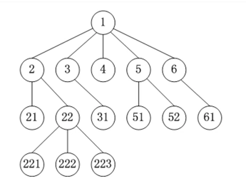
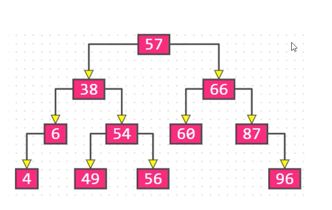
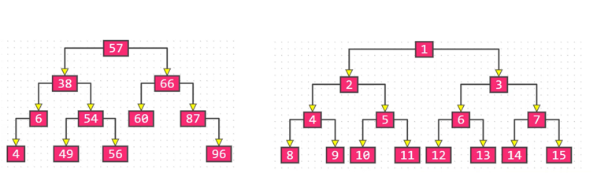
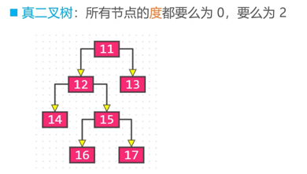
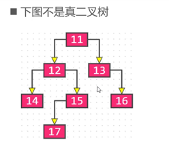
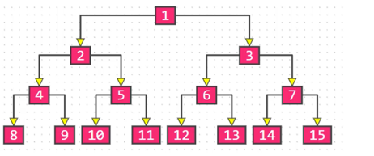
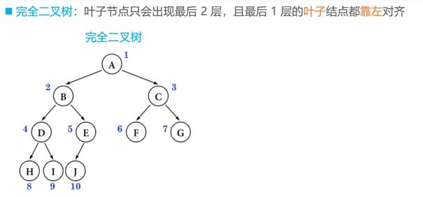
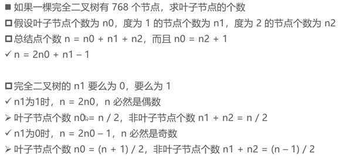

# 树

一个树只有一个根节点 父节点 兄弟节点 子节点 兄弟节点

## 1、空树

没有任何节点，就是空树； 一个树可以只有一个节点：就是根节点； 子树，左子树，右子树

## 2、节点的度

子树的个数 节点 1 的度就是 5；

节点 61 的度就是 0

## 3、叶子节点

度为 0 的节点；上图中的 4 就是叶子节点 非叶子节点：度不为 0 的节点

## 4、层数

根节点是第一层，后面的一次递增

## 5、节点的深度

从根节点到当前节点的唯一路径 比如 2 的深度是 2 ； 223 的深度是 4 ；是从1 开始的， 根节点是 1 ；

## 6、高度

从当前节点到最远叶子节点的路径上的节点数目 比如：2 的高度是 3； 5 的高度是 2 ； 从自己本身开始，自己就是 1 ；

## 7、树的深度等于树的高度

## 8、有序树

上图中的 2 3 4 4 5 6 都是顺序排列的

## 9、无序树

2 3 4 5 6 之间的顺序是没有规则的； 无序树也叫做自由树；

# 二叉树

## 1、二叉树的特点

（1）每个节点的度最大为 2 ； 最多拥有两个子树； 度的值为：0 1 2

（2）左子树和右子树之间是存在差异的；

（3）即使某个节点只有一颗子树，也是需要区分左子树和右子树

## 2、二叉树是有序树吗？

是的，因为左右子树是有严格的要求的

## 3、二叉树的性质

（3.1）非空二叉树的第 i 层，最多有 2 * i - 1 个节点 (i >= 1)； 树从第一层开始计算的，不是 0 层开始计算的

(3.2)在高度为 h 二叉树上面，里面最多存在着 2^h - 1 个节点（h >= 1）; 就是所有的元素都是满的；

(3.3)对于任何的非空二叉树，如果叶子节点的个数是 n0,度为 2 的节点个数为 n2 ，则有 n0 = n2 + 1

(3.4) 二叉树的边数目

## 4、真二叉树

所有节点的度要么是 0 要么是 2； 对于满二叉树，相关的额定义需要严格 一些；

下面的不是真二叉树：

## 5、满二叉树极其相关的性质

满二叉树的节点的度要么是 0 ，要么是 2 ，并且所有的叶子节点都是在最一层； 满二叉树是真二叉树的加强版本； 在同样高度的二叉树中，满二叉树的叶子节点的数目是最多的，总节点的数目是最多的；
满二叉树一定是真二叉树，真二叉树不一定是满二叉树；

满二叉树的叶子节点的数量：2^(h - 1)
总节点的数目为：n = 2^h - 1;

## 6、完全二叉树

叶子节点只会出现在最后两层，并且最后一层的叶子节点都是靠着左边进行对齐的； 最后一层的叶子节点是需要靠着左边进行对齐的； 如果在最后一层是在右边对齐的，就不是完全二叉树，需要加以区别；

## 7、完全二叉树的性质

度为 1 的节点只有左子树；

度为 1 的节点，要么是 0 个要么是 1 个；

完全二叉树的倒数第二层一定是一个满二叉树；

完全二叉树放满了就是满二叉树；

同样节点数量的二叉树，完全二叉树的高度是最小的；

拥有 n 个节点的二叉树，从 1 开始编号，第一个节点就是根节点，当 i > 1 的时候，它的父节点 的编号为：floor(i / 2) ;floor 是向下取整的函数；

如果 2i <= n ，左子节点的编号为： 2i;

2i > n 没有左子节点；

### 面试题目：

一个完全二叉树有 768 个节点，求叶子节点的个数：

总节点数量：n n 为奇数 叶子节点的数量： n0 = (n + 1) / 2;

n 为偶数 叶子节点数量： n0 = n / 2;

结算叶子节点的数量： n0 = n / 2 + 1 / 2;

使用取整函数进行公式的统一： n0 = floor(n / 2 + 1 / 2); 完美解决 上面提到的向上，向下取整都是可以互相替换的 ceiling();

