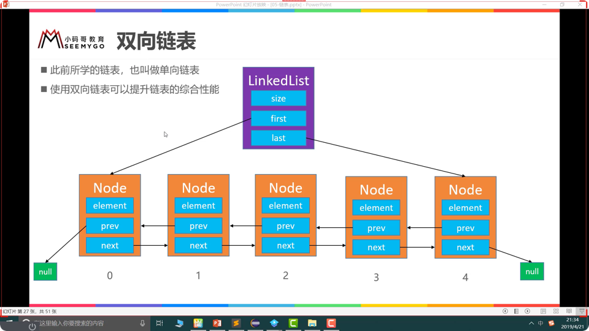
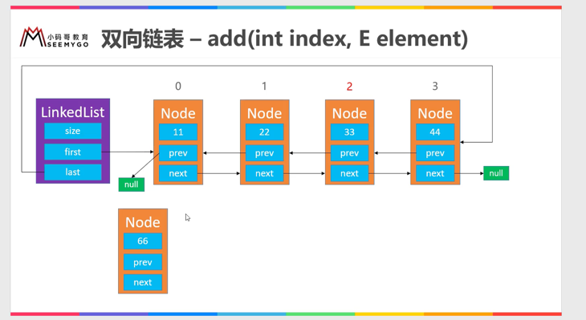

# 链表相关概念

链表： 动态数组的缺点： 1、造成空间的大量浪费

在上面的问题中，链表的动态的申请内存，是一种线性结构，元素的地址是不一定相同的

# 静态类相关概念

所谓静态，指以static关键字修饰的，包括类，方法，块，字段。 非静态，指没有用static 修饰的。 一、静态类的特点 1.全局唯一，任何一次的修改都是全局性的影响 2.只加载一次，优先于非静态 3.使用方式上不依赖于实例对象。
4.生命周期属于类级别，从JVM 加载开始到JVM卸载结束。

二、静态类和非静态类之间的区别 内部静态类不需要有指向外部类的引用。但非静态内部类需要持有对外部类的引用，非静态内部类能够访问外部类的静态和非静态成员。 静态类不能访问外部类的非静态成员。他只能访问外部类的静态成员
，一个非静态内部类不能脱离外部类实体被创建，一个非静态内部类可以 访问外部类的数据和方法，因为他就在外部类里面

# ArrayList 和 LinkedList

两者之间时间的大多数功能都是有一定的初伏的，但是具体实现又是完全不全的，所以不需要考虑使用继承的方式，考虑使用接口的形式定义一定的方式

均摊复杂度：

# 双向链表

双向链表将元素插入到头部示意图

# 动态数组和双向链表之间的区别：

    动态数组：开辟，销毁内存空间的次数相对来说是少的，但是可能造成内存空间的浪费（可以使用缩容机制）
    双向链表：开辟，销毁的次数相对来说是多的，对于内存空间的浪费是减少的

## 两种形式的数据结构的选择

    频繁的在尾部添加，删除：两者都可
    频繁的在头部添加，删除，双向链表
    任意位置的添加删除操作：使用双向链表
    频繁的查询：使用动态数组

## 单向链表的用处？

    哈希表用到了单向链表，为什么使用？

